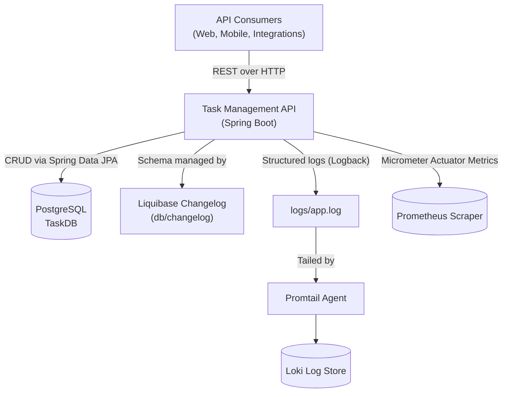
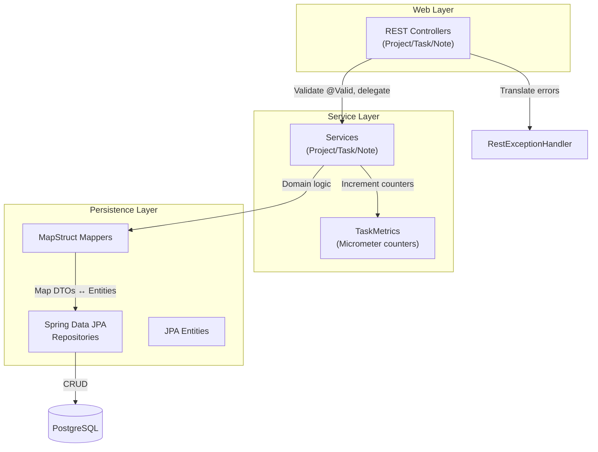
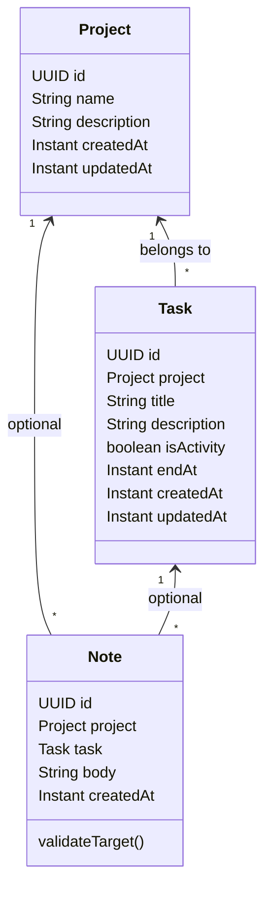
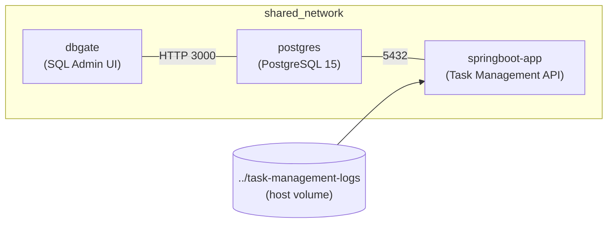

# Architecture Diagrams

The following Mermaid diagrams capture the key structural views of the Task Management backend service.

## System Context

This diagram shows how the Spring Boot service interacts with downstream systems for persistence, logging, and monitoring.

## Core Service Components

The layered architecture within the application separates HTTP concerns, domain logic, persistence, and cross-cutting monitoring.

## Domain Model Overview

Projects, tasks, and notes form the core aggregate relationships stored in PostgreSQL.

## Deployment (Docker Compose)

The default Docker Compose stack wires the service to PostgreSQL with optional admin tooling and persistent host-mounted logs.

