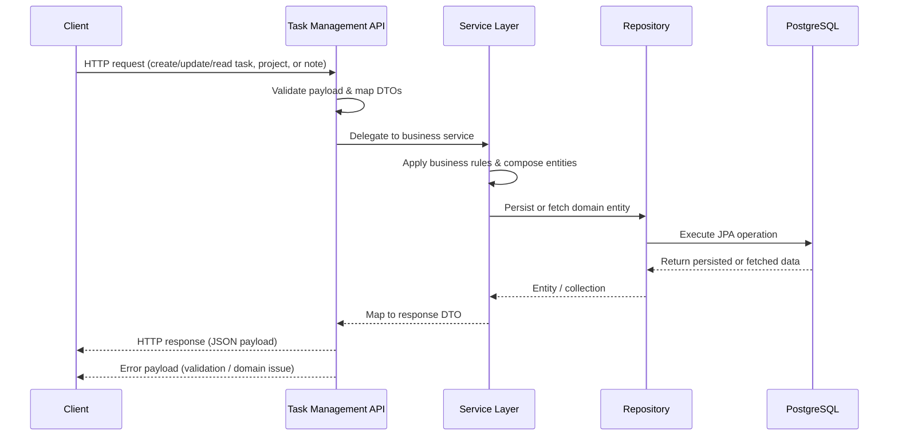
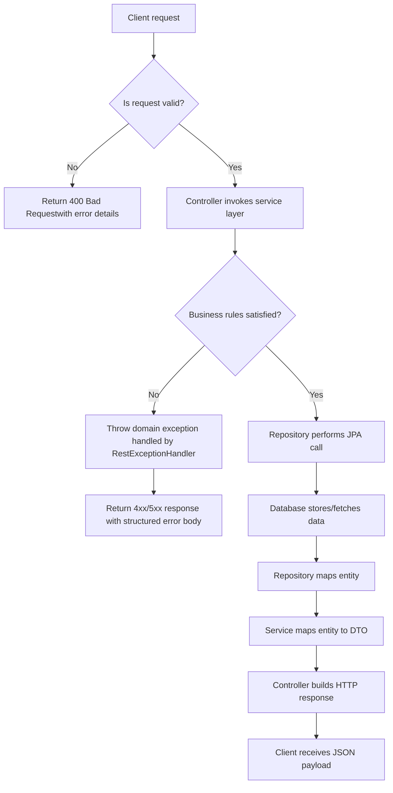

# Client Interaction Diagrams

The following diagrams describe how an external client works with the Task Management Service. They can be embedded directly in Markdown viewers that support [Mermaid](https://mermaid.js.org/) or rendered with tools such as the [Mermaid CLI](https://github.com/mermaid-js/mermaid-cli).

## Sequence diagram

## Flowchart

Both diagrams reflect the same happy-path and error handling behaviour that is implemented in the controllers, services, and repositories within this project.
